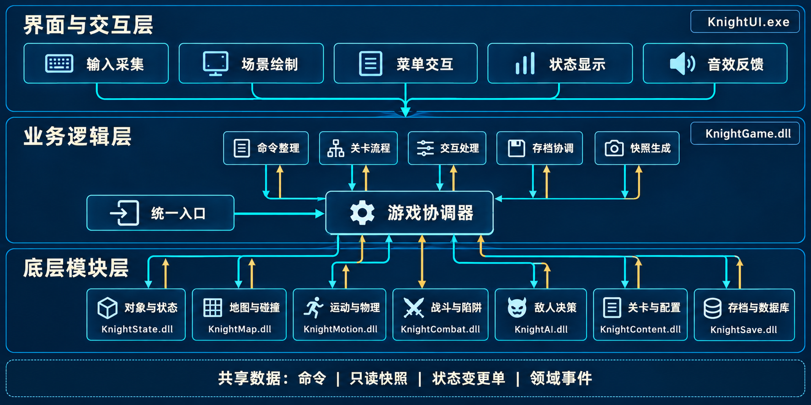
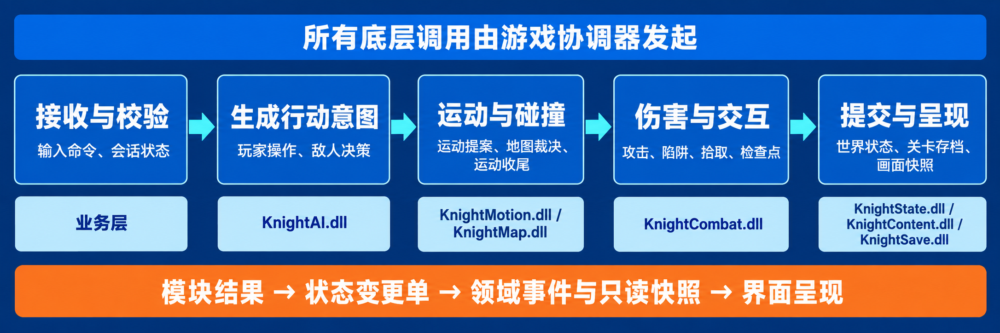
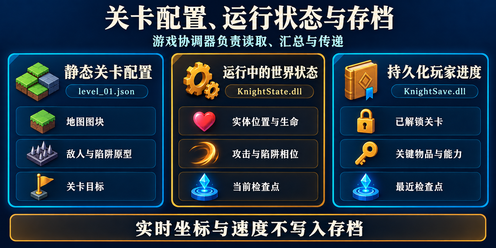

# 横版动作闯关游戏软件架构设计

**项目：** Qt Knight  
**版本：** 架构图文版 1.1  
**日期：** 2026 年 10 月 6 日  
**状态：** 完整架构设计文档

## 0 文档结论

本项目采用三层结构：**界面与交互层 → 业务逻辑层 → 底层模块层**。界面层只采集操作和显示结果；业务层的**游戏协调器**是唯一调度点；底层七个模块分别编译为独立动态链接库，只接收数据并返回结果，**彼此不链接、不调用、不共享可变对象**。关卡文件提供静态地图和规则，运行中的世界状态由对象与状态模块独占管理，数据库只保存可跨会话恢复的进度。每个逻辑帧按固定顺序完成输入、敌人决策、运动、碰撞、战斗、陷阱、关卡和画面快照，因而能明确说明一次操作如何改变数据。

建议先看图 1 理解三层与隔离边界，再看图 2 理解一次输入怎样变成世界变化，最后看图 3 区分关卡配置、运行状态与存档。表格和调用链给出图片中省略的具体字段与规则。



*图 1　三层架构与独立模块。界面层的汇聚线表示进入业务层；实际调用都经过“统一入口”。七个底层动态链接库只与游戏协调器交换数据，彼此没有调用关系。*

## 1 项目目标与约束

### 1.1 玩法目标

项目参考《Hollow Knight》的横版探索与战斗体验，制作独立的地图、角色、美术和音效。首版形成以下闭环：

1. 从主菜单选择开始或读取存档，进入关卡。
2. 角色在图块地图上左右移动、跳跃、攻击，镜头跟随。
3. 地图含平台、障碍、陷阱、敌人、拾取物、检查点和出口。
4. 玩家受击后扣血，死亡后在最近检查点复活。
5. 满足关卡目标后出口开启，进入下一关；进度可保存并恢复。
6. 游戏可暂停、继续、重试、返回菜单，并清楚显示失败信息。

首版建议至少提供三关、两类陷阱、两类敌人行为和一个关键物品门。复杂技能树、联网、剧情系统和关卡编辑器不进入首版的必要依赖。

### 1.2 技术与运行假设

- 使用 Qt 框架、C++ 语言和桌面操作系统；各动态链接库与主程序必须由同一工具链构建并一同部署。
- 首版采用二维场景视图绘制；场景视图仅是显示方式，玩法碰撞必须由底层地图模块计算。
- 逻辑更新固定为每秒六十次。计时器只负责唤醒循环，实际经过时间由单调时钟测量；每次唤醒可执行零到多个固定逻辑帧。
- 地图、敌人原型、陷阱参数属于版本化静态配置；存档采用 SQLite 数据库，只记录需要在下次启动后恢复的状态。
- 游戏模拟在主线程顺序运行。存档写入可交给单独工作线程，但该线程必须独立创建自己的数据库连接，并只接收不可变存档副本。

Qt 官方资料说明场景视图用于显示二维场景，定时器触发可能晚于设定时间，数据库连接应由其所属线程访问。因此不能把画面对象、定时器回调次数或跨线程数据库连接当作玩法状态。[场景视图说明](https://doc.qt.io/qt-6/qgraphicsview.html) · [定时器说明](https://doc.qt.io/qt-6/qtimer.html) · [数据库连接说明](https://doc.qt.io/qt-6/qsqldatabase.html)

## 2 三层职责与依赖规则

| 层级 | 部署文件 | 负责的事 | 对外传递的数据 | 禁止事项 |
|---|---|---|---|---|
| 界面与交互层 | `KnightUI.exe` | 显示菜单、地图、角色、状态栏；接收键盘和鼠标输入；播放音画反馈 | 向业务层提交命令；读取画面快照和领域事件 | 不改玩家生命和坐标；不判定碰撞；不写数据库 |
| 业务逻辑层 | `KnightGame.dll` | 维护会话状态；校验命令；安排每个逻辑帧的调用顺序；处理关卡流程、存档时机和错误 | 给底层模块传不可变输入；接收计算结果；向界面层返回快照和事件 | 不直接绘图；不解析数据库表；不把模块私有对象传给其他模块 |
| 底层模块层 | 第 3 节列出的七个动态链接库 | 保管世界状态或执行单项计算，加载静态关卡内容，持久化进度 | 只通过共享数据约定返回结果或错误 | 底层模块之间不得建立链接依赖、函数调用或全局共享内存 |

**依赖只有两个方向：** 主程序调用业务动态链接库；业务动态链接库调用七个底层动态链接库。底层模块均可包含同一份只定义数据结构和接口的头文件 `KnightContracts.hpp`，但该头文件不产生运行时模块，也不允许藏入跨模块单例。底层模块不能回调业务层；业务层读取结果后决定下一步。

### 2.1 物理隔离的可执行要求

1. 七个底层动态链接库分别拥有独立工程目标、源目录和导出接口。任一底层动态链接库的链接项中不得出现另一底层动态链接库。
2. 每个底层接口只接收值对象或只读数据视图，返回结果对象；不得接收其他模块的实现类指针、数据库连接或图形对象指针。
3. 只有业务层的游戏协调器持有七个模块接口。业务层的命令整理、关卡流程、交互处理、存档协调、快照生成是协调器内部的独立职责，不彼此直接调用。
4. 界面层只能通过统一入口接触业务层。不同界面组件之间传递交互时也经统一入口和当前画面状态，不读取彼此内部状态。
5. 生产构建中可静态链接各动态库的导入库以获得类型检查，但运行时仍部署为独立动态链接库；不得把七个底层目标合并成一个二进制文件。

### 2.2 模块之间传递什么

共享数据约定定义四类对象，具体实现与私有状态留在各模块内部：

| 数据类型 | 精确字段 | 用途 |
|---|---|---|
| 玩家命令 | 命令编号（六十四位整数）、逻辑帧号、动作类型、按下或释放、方向值、来源界面 | 表达用户意图；只由界面提交给业务层 |
| 世界只读快照 | 关卡标识、逻辑帧号、实体摘要列表、地图查询所需图块摘要、关卡标志 | 供各算法模块计算；不允许原地修改 |
| 状态变更单 | 目标实体标识、字段变化、变化原因、优先级、来源逻辑帧 | 由业务层验证后统一交给对象与状态模块提交 |
| 领域事件 | 事件编号、逻辑帧号、事件类型、发起者、目标、位置、负载 | 告诉业务层有攻击命中、玩家死亡、检查点激活、关卡完成等事实 |

共享数据结构需要带版本号。跨动态库异常不外抛；每个调用返回“成功/错误码/错误说明”。同一构建版本内使用统一的编译器与运行时，避免不同二进制接口约定造成内存管理错误。

## 3 动态链接库与模块职责

| 文件名 | 中文模块名 | 唯一职责与主要导出能力 | 依赖边界 |
|---|---|---|---|
| `KnightState.dll` | 对象与状态模块 | 创建、查询、提交和销毁实体；维护当前关卡世界状态；按标识返回只读快照；原子应用状态变更单 | 不自行计算碰撞、伤害、存档 |
| `KnightMap.dll` | 地图与碰撞模块 | 根据图块和碰撞盒裁决位移；查询地面、阻挡、危险区、出口和交互范围；维护局部空间索引 | 不修改世界状态，不调用运动模块 |
| `KnightMotion.dll` | 运动与物理模块 | 根据速度、重力、玩家/敌人意图计算本帧运动提案、跳跃和击退；根据碰撞裁决生成最终运动结果 | 不读取键盘，不调用地图模块 |
| `KnightCombat.dll` | 战斗与陷阱模块 | 推进攻击阶段、计算命中、陷阱触发、伤害、无敌时间和死亡候选结果 | 不直接改生命值，不调用对象模块 |
| `KnightAI.dll` | 敌人决策模块 | 基于只读视野和敌人状态产生巡逻、追击、攻击、返回等意图 | 不直接改敌人坐标，不调用地图或战斗模块 |
| `KnightContent.dll` | 关卡与配置模块 | 读取并校验地图、对象原型、关卡目标、资源清单和版本；返回完整关卡定义 | 不创建运行时实体，不写进度数据库 |
| `KnightSave.dll` | 存档与数据库模块 | 建库与迁移、读取槽位、事务写入进度、校验存档版本、返回错误 | 不读取运行中世界对象，不决定何时存档 |

`KnightGame.dll` 内的**游戏协调器**依次调用这些模块。它是唯一允许跨模块汇合数据的地方。例如运动模块先返回“建议位移”，协调器再将建议位移交给地图模块；地图模块只看到输入数据，不知道运动模块存在。协调器将最终运动结果和战斗结果合并为变更单，再交由对象与状态模块一次提交。

### 3.1 工程目录与构建关系

```text
src/
  contracts/        KnightContracts.hpp
  ui/               KnightUI.exe 的界面与交互实现
  game/             KnightGame.dll 的游戏协调器及业务职责
  state/            KnightState.dll
  map/              KnightMap.dll
  motion/           KnightMotion.dll
  combat/           KnightCombat.dll
  ai/               KnightAI.dll
  content/          KnightContent.dll
  save/             KnightSave.dll
assets/             贴图、音频与关卡配置
docs/               架构文档与待生成配图
tests/              模块契约、玩法流程和存档测试
```

构建规则可以机械检查：`KnightUI.exe` 只链接 `KnightGame.dll`；`KnightGame.dll` 链接七个底层动态链接库；每个底层动态链接库只依赖框架基础库、标准库和 `KnightContracts.hpp`。技术框架库不计作项目内部模块调用。

## 4 界面与交互层

界面细节后续设计，但输入与输出必须先固定，否则业务逻辑会侵入窗口代码。

| 内部职责 | 输入 | 输出 |
|---|---|---|
| 输入采集 | 键盘按下/释放、鼠标点击、窗口失焦 | 标准化玩家命令；按住状态在每个逻辑帧形成输入帧；窗口失焦时清空按住状态 |
| 场景绘制 | 只读画面快照 | 绘制可见地图图块、角色、陷阱、攻击特效和镜头位置 |
| 菜单交互 | 主菜单、暂停菜单、死亡与过关页面上的选择 | 开始、读取、暂停、继续、重试、退出等菜单命令 |
| 状态显示 | 玩家和关卡摘要 | 生命、能量、当前关卡、检查点和提示信息 |
| 音效反馈 | 领域事件 | 根据事件类型播放命中、受击、检查点、开门等反馈 |

建议动作表：左移、右移、跳跃、攻击、交互、暂停、菜单确认、菜单返回。具体键位可配置；业务层只认识动作，不认识某个键。持续动作如移动记录“按住”；跳跃、攻击、交互记录“本帧新按下”，避免键盘自动重复造成多次触发。绘图使用内部显示对象标识关联实体标识，但显示对象始终不是世界状态的权威来源。

## 5 业务逻辑层

### 5.1 内部职责

| 中文职责名 | 输入与判断 | 输出或调用 |
|---|---|---|
| 统一入口 | 接收界面命令、真实经过时间；检查参数与会话是否存在 | 将命令排队，返回快照与事件 |
| 游戏协调器 | 按固定顺序推进逻辑帧；持有各底层模块接口 | 调用各模块，合并结果，提交状态变更 |
| 命令整理 | 合并方向按住状态；消除自动重复；给命令编号和归属帧 | 玩家意图与菜单意图 |
| 关卡流程 | 判断开始、加载、通关、失败、复活、切关是否合法 | 读取新关卡、建立新世界、解锁进度 |
| 交互处理 | 检查玩家是否在对象范围内，判断是否可交互 | 拾取、检查点、门、出口的变更单 |
| 存档协调 | 在检查点、过关、主动退出时截取可持久化数据 | 向存档模块提交不可变副本，处理完成/失败 |
| 快照生成 | 从已提交的世界状态和事件取得显示信息 | 只读画面快照供界面消费 |

“职责”是 `KnightGame.dll` 内的独立实现单元，不是互相调用的服务网络。它们由游戏协调器统一调度；若一个职责需要另一个职责的结果，协调器先接收结果，再作为数据传给下一个职责。

### 5.2 会话状态机

| 当前状态 | 允许命令 | 转移条件 | 目标状态 |
|---|---|---|---|
| 主菜单 | 开始、读取、退出 | 关卡与存档校验通过 | 加载中 |
| 加载中 | 取消或等待 | 新关卡数据完整且世界创建成功 | 游玩中 |
| 游玩中 | 移动、跳跃、攻击、交互、暂停 | 暂停命令 | 已暂停 |
| 游玩中 | 同上 | 玩家生命归零 | 死亡中 |
| 游玩中 | 同上 | 目标达成且进入出口 | 关卡完成 |
| 已暂停 | 继续、重试、返回菜单 | 继续命令 | 游玩中 |
| 死亡中 | 复活、返回菜单 | 复活点可用 | 加载中，再进入游玩中 |
| 关卡完成 | 下一关、返回菜单 | 下关存在且可加载 | 加载中 |

加载失败不能留下半个世界：旧会话保持安全状态，错误通过事件显示。暂停时停止逻辑时间；恢复时重置计时基准，避免一次执行大量补帧。死亡发生的逻辑帧中不再激活检查点或出口。

## 6 单帧调用顺序与数据流

一个“逻辑帧”指固定的六十分之一秒，画面刷新次数与它无关。游戏协调器持有当前关卡定义和底层接口，在帧开始从对象与状态模块读取**只读世界快照**；本帧中间结果放在协调器自己的临时计算草稿中，直到第七步才统一提交。这样七个底层模块无需互相访问。



*图 2　单帧业务流程概览。五个阶段对应下表的九个顺序步骤；“伤害与交互”包含攻击、陷阱、拾取和检查点。模块结果由协调器汇总，底层模块之间不互相调用。*

| 顺序 | 协调器执行的动作 | 接触的模块 | 输入 → 输出 |
|---|---|---|---|
| 1 | 接收并归属本帧输入命令 | 界面统一入口、命令整理 | 按键/菜单操作 → 带编号的动作集合 |
| 2 | 校验会话状态、技能冷却、玩家是否存活；形成玩家意图 | 业务层内部 | 动作集合 + 当前只读快照 → 合法玩家意图 |
| 3 | 为当前可见敌人生成意图 | 敌人决策模块 | 敌人状态 + 玩家位置 + 关卡规则 → 敌人意图 |
| 4 | 计算玩家、敌人与投射物的建议位移 | 运动与物理模块 | 意图 + 当前运动状态 + 固定时间步长 → 运动提案 |
| 5 | 裁决地图和实体阻挡，修正位移、速度与落地状态 | 地图与碰撞模块 | 运动提案 + 图块数据 + 碰撞盒 → 碰撞裁决；协调器形成临时位置草稿 |
| 6 | 判定攻击、接触伤害与陷阱；对仍存活角色判定拾取物、检查点和出口 | 战斗与陷阱模块、业务层交互处理 | 临时位置草稿 + 攻击/陷阱数据 → 已裁决的生命、击退、攻击状态与交互候选变更 |
| 7 | 合并变更，按优先级和实体标识稳定排序，并一次提交世界状态 | 对象与状态模块 | 位移、生命、机关、拾取等变更单 → 新世界快照 + 领域事件 |
| 8 | 根据新状态判断死亡、过关、载入下一关和存档时机 | 业务层关卡流程、关卡与配置模块、存档与数据库模块 | 领域事件 + 关卡目标 → 会话转移/存档请求 |
| 9 | 形成只读画面快照并交给界面 | 业务层快照生成 | 已提交状态 + 领域事件 → 地图可见区、实体显示、状态栏、反馈事件 |

**唯一提交点是第七步。** 第八步若要切换关卡，协调器先读取并完整验证下一关定义，再请求对象与状态模块以“新关卡初始化”操作替换世界；若读取失败，保持原关卡已完成状态并提示失败。检查点和拾取物的变更已在第六步形成、第七步提交，因此第八步存档读取的是一致状态。

### 6.1 时间、顺序和冲突规则

- 运动积分使用固定时间步长；建议参数为重力每秒平方一千五百世界单位、基础水平速度每秒二百二十单位、跳跃初速每秒五百二十单位。所有数值都由配置控制，逻辑中不散落常量。
- 每次界面唤醒把实际经过时间加入累积器，单次计入不超过二百五十毫秒，每次绘制前最多执行五帧。超过的积压时间丢弃并记录性能指标，防止无限追帧。
- 同帧的伤害候选按“事件优先级、来源实体标识、目标实体标识”稳定排序；无敌时间先于扣血生效。一项攻击实例对同一目标只命中一次。
- 地图碰撞完成后才计算攻击命中，保证攻击范围使用修正后的站位。生命归零后，本帧的检查点与出口候选无效。
- 若同帧存在暂停与移动，先处理暂停；该帧不推进世界。菜单输入与战斗输入互斥。

## 7 底层对象数据设计



*图 3　三类数据的归属。关卡文件是静态定义；对象与状态模块持有当前运行状态；存档模块只持久化进度。三者由游戏协调器读取和传递，图中的分栏不表示模块之间存在直接调用。*

### 7.1 字段类型与数据来源约定

下面所有坐标、尺寸、速度均使用世界坐标，向右为横轴正方向，向下为纵轴正方向；角度和像素坐标只在绘制适配器内部使用。**配置字段**从关卡或原型文件加载，**运行字段**仅在当前会话存在，**存档字段**需要跨会话恢复。实体标识是关卡内唯一的六十四位整数；需要跨关卡追踪的物品另有稳定的字符串标识。

| 通用结构 | 必须定义的属性及类型 | 约束 |
|---|---|---|
| 二维坐标 | 横坐标、纵坐标：浮点数 | 单位为世界单位；数据应为有限数值 |
| 矩形碰撞盒 | 左上偏移、宽、高：浮点数 | 宽高大于零，跟随实体位置移动 |
| 实体基础信息 | 实体标识：六十四位整数；关卡标识：字符串；类别：枚举；位置：二维坐标；朝向：左/右；启用：布尔值；阵营：枚举；碰撞盒：矩形；资源键：字符串 | 由对象与状态模块独占管理；资源键只供界面查找图像 |
| 运动状态 | 水平速度、垂直速度：浮点数；是否落地、是否贴墙：布尔值；剩余击退时间：逻辑帧数 | 每帧变化，不直接存档 |
| 生命状态 | 当前生命、最大生命：整数；无敌截止帧：六十四位整数；是否死亡：布尔值 | 当前生命介于零与最大生命之间 |

### 7.2 具体实体与属性

| 对象 | 必须定义的具体属性 | 数据性质与主要规则 |
|---|---|---|
| 玩家 | 实体基础信息；运动状态；生命状态；基础移动速度、跳跃初速、空中控制系数、最大跳跃次数；当前已用跳跃次数；攻击原型标识；攻击冷却截止帧；能量与最大能量；已解锁能力集合；背包物品集合；当前检查点标识 | 基础能力是配置；位置、速度、冷却、无敌截止帧是运行字段；能力、背包和检查点是存档字段。死亡后生命恢复到复活规则规定的值。 |
| 敌人 | 实体基础信息；运动状态；生命状态；敌人原型标识；决策状态（巡逻/警戒/追击/攻击/返回/死亡）；巡逻点序列；索敌半径；脱离半径；移动速度；攻击原型标识；下次可攻击帧；目标实体标识；掉落表标识 | 原型和巡逻点为配置；决策状态、目标、冷却为运行字段。敌人决策模块只产生意图，不能自行改位置。 |
| 陷阱 | 实体基础信息；陷阱类型（静态尖刺/周期机关等）；触发区域；触发方式（接触/周期/交互）；伤害值；击退量；周期帧数；激活帧数；当前相位；是否启用；每目标再次伤害间隔；上次命中记录 | 类型、区域和数值为配置；当前相位与命中记录为运行字段。静态尖刺始终处于有效相位。 |
| 攻击实例 | 实例标识；发起者标识；阵营；攻击原型标识；开始帧；起手、有效、收招三段持续帧数；当前阶段；相对命中框；伤害值；击退向量；已命中目标集合 | 完全是运行字段；有效阶段才产生伤害，已命中集合避免同一次挥击重复扣血。 |
| 投射物 | 实体基础信息；发射者标识；速度向量；伤害值；碰撞盒；出生帧；存活帧数；可穿透次数 | 完全是运行字段；超时、击中阻挡或穿透次数耗尽后销毁。 |
| 拾取物 | 实体基础信息；物品稳定标识；物品类型；数量；拾取范围；是否已拾取；是否跨会话保存 | 关键物品的稳定标识写入存档；普通临时补给可不保存。 |
| 检查点 | 稳定标识；关卡标识；交互区域；复活位置；激活条件；是否已激活；资源键 | 定义来自关卡文件；玩家最近激活的标识写入存档。 |
| 出口或门 | 稳定标识；触发区域；目标关卡标识；开启条件集合；是否开启；进入后的出生点标识；资源键 | 定义来自关卡文件；开启状态可由已满足条件推导。永久解锁的门状态才写入存档。 |

**为什么分开攻击实例与玩家：** 玩家可以在同一时刻拥有正在收招的近战攻击和已飞出的投射物。攻击实例记录“这一次攻击击中过谁”，玩家只保存何时能再次攻击，职责不会混乱。

### 7.3 地图、关卡与世界对象

| 对象 | 必须定义的属性 | 规则 |
|---|---|---|
| 图块地图 | 关卡标识；图块边长；宽、高（图块数）；背景层、实体阻挡层、危险层、装饰层；相机边界；版本号 | 图块下标必须在范围内；地图与碰撞模块只读。背景和装饰不参与碰撞。 |
| 关卡定义 | 关卡标识；地图资源文件名；出生点列表；敌人/陷阱/拾取物/检查点/出口定义列表；目标条件；下关标识；允许复活规则；资源清单 | 关卡与配置模块必须先整体验证，再交给协调器初始化世界。 |
| 关卡目标 | 目标类别（到达出口/持有关键物品/清除指定敌人等）；目标对象标识；所需数量；完成标记 | 目标条件由业务层关卡流程判定；出口仅在全部必要条件满足时开启。 |
| 世界状态 | 当前关卡标识；当前逻辑帧号；实体注册表；关卡运行标志；已触发事件序号；当前检查点标识 | 对象与状态模块是唯一写入者；其他模块只能收到只读快照。 |
| 画面快照 | 关卡标识；逻辑帧号；可见图块范围；实体显示列表（实体标识、位置、朝向、动画键、显示层级）；玩家状态栏；相机中心；提示列表 | 只给界面绘制使用，不反向写回世界。 |

关卡文件示意：`level_01.json`、`level_02.json`、`level_03.json`。每个文件必须包含格式版本、关卡标识、图块尺寸、地图层、出生点、关卡目标、出口目标和对象列表。内容加载时检查：标识唯一、坐标位于关卡边界、出口目标存在、检查点有安全复活位置、引用的原型和资源键存在。任一检查失败则拒绝整关加载，并指出具体对象标识与字段。

## 8 存档与数据库设计

地图文件是开发时维护的**静态定义**，数据库是玩家游玩产生的**持久化进度**，两者不得互相复制。敌人的实时位置、陷阱当前相位、正在进行的攻击和每帧速度不存档。首版以“检查点状态”恢复，而不是精确恢复某一帧。

| 数据表 | 主键与必要字段 | 写入时机 |
|---|---|---|
| 存档槽位 | 槽位标识（整数主键）；格式版本；创建时间；最后保存时间；当前关卡标识；最近检查点标识；玩家最大生命；恢复后生命；玩家最大能量；恢复后能量 | 新建槽位、检查点、过关、主动退出 |
| 关卡进度 | 槽位标识与关卡标识（联合主键）；是否解锁；是否通关；通关次数；最佳用时 | 解锁或完成关卡 |
| 关键物品 | 槽位标识与物品稳定标识（联合主键）；数量；是否已领取 | 获得或消耗需要持久化的物品 |
| 能力进度 | 槽位标识与能力标识（联合主键）；是否解锁；等级 | 获得或升级能力 |
| 永久机关 | 槽位标识与机关稳定标识（联合主键）；状态值 | 永久开门或永久改变机关 |
| 设置 | 设置名（主键）；设置值；值类型；最后修改时间 | 更改音量、键位和画面设置 |

存档写入顺序：业务层从第七步之后的一致世界状态制作**存档副本** → 存档模块开启事务 → 写入槽位及相关进度表 → 全部成功则提交事务，否则回滚 → 返回“保存成功/失败”事件。读档时先校验格式版本和引用关卡是否存在；损坏存档不能覆盖现有内存会话。数据库模式升级通过递增版本迁移，禁止静默丢弃旧进度。

如采用后台存档线程，工作线程独自创建、使用和关闭数据库连接；它只接收不可变副本，不能持有对象与状态模块的指针。保存失败不应令游戏进程崩溃：显示失败提示、保留内存进度并允许再次保存。过关时的关卡解锁先在内存中生效，事务失败时明确提示“本次进度尚未保存”。

## 9 底层算法与判定规则

### 9.1 地图与运动

首版使用轴对齐矩形包围盒。地图与碰撞模块先根据运动提案的扫过范围获取附近的实心图块，再依次裁决横向和纵向位移，返回允许位移、碰撞法线、是否落地和是否撞顶。高速投射物或高速冲刺需要使用连续扫掠判定，避免一步跨过薄墙。地面判定不能由绘图对象的接触结果决定。动态实体之间是否互相阻挡由碰撞类别矩阵配置，例如玩家与实心平台阻挡、玩家与拾取物只触发、不阻挡。

运动与物理模块只计算“希望移动到哪里”，地图与碰撞模块只回答“实际允许移动到哪里”；二者不直接调用。协调器收到碰撞裁决后，可再次调用运动模块的“碰撞后收尾”接口，以清除撞墙方向的速度并更新落地标志，再形成状态变更单。镜头跟随属于画面快照生成，不改变物理坐标。

### 9.2 战斗与陷阱

攻击原型至少包含伤害、起手帧数、有效帧数、收招帧数、命中框、击退量、能量消耗和冷却帧数。攻击命令只有在玩家存活、未被禁止动作、能量足够且冷却结束时才能生成攻击实例。命中发生在有效阶段，按阵营过滤友军；同一次攻击实例的已命中目标集合防止重复扣血。受到有效伤害时先检查无敌截止帧，再扣血、设置短暂无敌时间和击退；生命达到零才生成死亡事件。

静态尖刺按“触碰危险区且目标可受伤”产生伤害候选。周期机关用“周期帧数、激活帧数、相位偏移”计算是否激活，不能依赖动画是否正在播放。每个目标的再次受伤间隔避免持续接触在每一帧扣血。陷阱动画播放由领域事件触发，但动画状态不决定真实伤害状态。

### 9.3 敌人决策与闯关

首版敌人采用有限状态：巡逻、警戒、追击、攻击、返回、死亡。决策模块每帧从只读快照计算意图；进入索敌半径、失去目标、攻击距离和冷却共同决定状态转移。索敌半径与脱离半径分开配置，避免敌人在边界来回抖动。高级寻路可之后增加，但不能让敌人决策模块直接读取地图模块内部索引。

关卡目标由业务层判断。例如“持有钥匙并进入出口”需要同时满足关键物品条件和出口重叠；“清除指定敌人并进入出口”只检查被标记的目标敌人。出口在目标未满足时可显示锁定提示，但不能切关。下一关必须先通过关卡配置校验，再原子创建新世界，避免切关中途失败破坏当前进度。

## 10 关键操作的完整调用链

### 10.1 左右移动与跳跃

1. 输入采集记录“左/右按住”或“跳跃新按下”，统一入口在下一逻辑帧接收动作。
2. 命令整理形成玩家意图；业务层检查会话处于游玩中、玩家存活、剩余跳跃次数和动作限制。
3. 游戏协调器读取世界快照，连同固定时间步长交给运动模块；运动模块返回建议速度和位移。
4. 游戏协调器把建议位移、碰撞盒及附近图块数据交给地图模块；地图模块返回裁决后的位移与碰撞法线。
5. 游戏协调器用碰撞裁决完成运动收尾，把位置、速度、落地和跳跃次数变化形成变更单，并在第七步交给对象与状态模块。
6. 新快照中的玩家位置和动画状态返回界面绘制。界面绘制时可插值，但插值不能写回世界状态。

### 10.2 攻击、命中与受击

1. 输入采集把“攻击新按下”提交业务层；业务层检查生命、冷却、能量和是否允许攻击。
2. 游戏协调器以攻击原型和玩家当前位置创建本次攻击候选。战斗模块推进起手、有效、收招阶段。
3. 地图裁决后的临时位置草稿送入战斗模块；模块按命中框、阵营和本次已命中集合输出伤害候选。
4. 战斗与陷阱模块按稳定顺序检查无敌时间、计算生命与击退变化，并记录本次已命中集合。协调器合并该模块返回的变更单与运动、交互变更单，再一次提交对象与状态模块。
5. 提交产生攻击开始、命中、受击或死亡事件；界面根据事件播放动画和音效，状态栏从新快照显示生命变化。

### 10.3 触发陷阱与复活

1. 地图模块返回玩家与危险区的接触信息，陷阱状态和接触信息由协调器交给战斗与陷阱模块。
2. 战斗与陷阱模块检查机关相位、启用状态、该玩家再次受伤间隔与无敌时间，输出已经裁决的生命和击退变更。
3. 协调器把扣血、击退或死亡写入变更单。若玩家死亡，交互候选被取消，生成死亡事件。
4. 选择复活后，关卡流程读取最近检查点标识，查找安全复活位置，重建本关运行状态；玩家生命按关卡复活规则恢复，已持久化的关键物品和能力保留。

### 10.4 检查点、出口与下一关

1. 玩家进入检查点交互范围并发出交互命令；交互处理检查距离、玩家存活和检查点条件，形成激活候选。
2. 第七步提交检查点激活状态；第八步存档协调从已提交状态制作存档副本，向存档模块提交事务写入。
3. 玩家进入出口时，关卡流程检查目标条件和出口是否开启。未满足时只产生提示事件。
4. 条件满足则产生关卡完成事件，更新内存进度并请求保存；随后读取下一关定义、验证全部引用、创建新世界，再让界面显示下一关。
5. 下一关载入失败时保留“本关已完成”状态，允许重试载入；不得把旧世界删除后只留下错误页面。

### 10.5 菜单与存档选择

主菜单的“新游戏”命令要求创建空槽位并加载首关；“继续游戏”命令要求先由存档模块读取并校验槽位，再由关卡与配置模块读取对应关卡，最后由对象与状态模块创建世界。暂停菜单的“继续”只改会话状态；“重试”从关卡出生点或最近检查点重建世界；“保存并返回菜单”先请求保存，得到成功或明确失败后再返回菜单，避免玩家误以为已保存。

## 11 对外接口清单

下表定义模块出口应完成的操作。方法名在代码中可以采用团队约定，但**中文语义、输入、输出和所有权不得变化**。

| 提供方 | 对业务层开放的操作 | 输入 | 输出 |
|---|---|---|---|
| 对象与状态模块 | 初始化世界；读取只读快照；原子提交变更单；重建检查点世界 | 已验证关卡定义、变更单或检查点信息 | 世界快照、领域事件或错误 |
| 地图与碰撞模块 | 建立关卡碰撞查询；裁决运动；查询触发区 | 地图定义、只读实体摘要、运动提案 | 碰撞裁决、触发区命中列表或错误 |
| 运动与物理模块 | 计算运动提案；碰撞后收尾 | 运动状态、意图、固定步长、碰撞裁决 | 建议运动或最终运动变化 |
| 战斗与陷阱模块 | 推进攻击；计算伤害候选；判定陷阱 | 临时位置草稿、攻击实例、陷阱定义 | 伤害候选、攻击状态变化、事件候选 |
| 敌人决策模块 | 生成敌人意图 | 可见实体摘要、敌人状态、决策配置 | 巡逻/追击/攻击等意图 |
| 关卡与配置模块 | 读取并校验关卡；读取对象原型；读取资源清单 | 关卡标识或资源标识 | 完整不可变定义或具体校验错误 |
| 存档与数据库模块 | 初始化数据库；读取槽位；事务写入；迁移模式 | 槽位标识、不可变存档副本 | 进度数据、写入结果或错误 |

业务层对界面只开放四项：**提交命令、推进真实经过时间、读取画面快照、取走待消费事件**。事件取走后不再重复返回；画面快照不可由界面修改。业务层不能向界面泄漏任何底层实现类或数据库连接。

## 12 错误处理、验证与实施顺序

### 12.1 必须处理的失败情况

| 失败情况 | 系统行为 |
|---|---|
| 地图文件缺失或对象引用错误 | 关卡加载失败，保留安全会话，错误指出文件名、对象标识和字段；不创建半成品世界 |
| 存档版本不兼容或数据损坏 | 不覆盖现有内存状态；提示无法读取并允许新建槽位或选择其他槽位 |
| 存档写入失败 | 回滚事务；保留内存进度并显示“尚未保存”；允许重新保存 |
| 连续按键或失去焦点 | 抑制自动重复触发；失焦时释放所有按住动作 |
| 窗口卡顿导致积压时间过多 | 限制单次追帧，记录卡顿；不让世界在恢复时瞬间推进数秒 |
| 动态库缺失 | 直接链接的动态库可能在程序入口执行前触发装载错误；发布检查应提前报告缺失文件名，程序不进入游玩会话。 |

### 12.2 验收标准

1. **隔离可检查：** 构建配置与二进制依赖中，七个底层动态链接库不存在相互链接；底层源代码不存在对其他底层实现头文件的包含或直接调用。
2. **输入可追踪：** 任一次移动、攻击、交互、菜单选择，都能按“命令编号 → 逻辑帧 → 模块结果 → 状态变更 → 事件/快照”追踪。
3. **玩法可完成：** 连续完成三关，经过陷阱、敌人、检查点和门，死亡后复活，退出重启后从最近存档继续。
4. **规则可复现：** 固定输入序列与相同关卡配置产生同样的实体状态和事件顺序；重复攻击不会在一次挥击中多次伤害同一目标。
5. **存档可恢复：** 保存事务完整；模拟写入失败后，旧存档仍可读取；内容引用失效时给出明确错误。
6. **画面可替换：** 改换场景绘制实现不要求修改地图、战斗、敌人决策或数据库模块。

### 12.3 推荐实施顺序

第一阶段实现共享数据约定、关卡配置校验、对象与状态模块、地图碰撞和最小画面；实现左右移动、跳跃和一张可通行地图。第二阶段加入战斗、陷阱、敌人决策和死亡复活；用固定输入序列验证顺序。第三阶段加入检查点、出口、三关流程和存档数据库；最后完善菜单、音画反馈与部署检查。每阶段都保持七个底层目标的独立构建边界。
