# 业务逻辑与数据流设计

**项目：** Qt Knight  
**版本：** 业务流程设计稿 0.1  
**依据：** [项目总体架构](游戏大体框架.md)、[模块接口协作约定](模块及接口设置.md)

## 1 总览：业务分为哪几类

界面层负责把键盘、鼠标和定时唤醒转成命令，负责显示结果；业务动态库的**游戏协调器**负责解释命令和决定调用顺序。七个底层动态库只接收数据、返回结果，彼此没有函数调用。本文按目标接口描述业务流程，不记录本地代码的开发状态。

| 业务类别 | 常见触发 | 业务层负责的判断 | 依赖的底层模块 | 可见结果 |
|---|---|---|---|---|
| 会话和菜单 | 点击开始、继续、重试、退出 | 当前会话状态、目标关卡和存档是否合法 | 关卡与配置、对象与状态、存档与数据库 | 打开关卡或显示错误 |
| 输入和移动 | 按下、按住、释放方向键；按跳跃键 | 把物理按键转成动作，检查玩家存活和动作限制 | 敌人决策、运动与物理、地图与碰撞、对象与状态 | 玩家和敌人位置、动画状态更新 |
| 战斗与危险 | 按攻击键、敌人攻击、接触陷阱 | 冷却、能量、无敌时间、同一次攻击去重 | 战斗与陷阱、地图与碰撞、对象与状态 | 命中、受伤、死亡和音画事件 |
| 关卡交互 | 拾取、检查点、门、出口 | 距离、关卡目标、死亡优先级 | 地图与碰撞、对象与状态、关卡与配置 | 物品、检查点、解锁、切关 |
| 进度持久化 | 检查点、通关、主动保存 | 从已提交状态提取可存档副本，决定保存时机 | 对象与状态、存档与数据库 | 保存成功或失败提示 |
| 显示与反馈 | 每次逻辑帧完成、状态变化 | 制作画面快照，分发一次性事件 | 对象与状态；静态资源定义来自关卡与配置 | 地图、角色、状态栏、提示和音效 |

### 1.1 唯一合法的调用方向

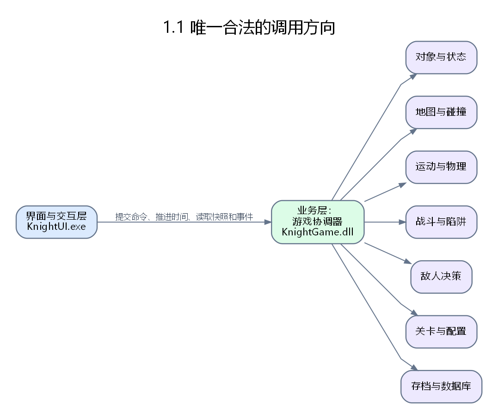

图中没有底层模块之间的箭头。例如运动模块给出建议位移后，**协调器先接收该结果，再把数据交给地图模块**。地图模块不知道运动模块存在；战斗模块也不能直接找状态模块扣血。

**读图方法：** 具体流程图方框中的“模块：函数”表示该层调用的入口；带“业务层”的方框表示协调器接收上一模块的返回值、检查结果并组装下一次调用的参数。箭头上的文字是传递的数据或分支条件，菱形表示业务判断。流程图已导出为图片，原始图文件存放在 `docs/assets`；底层函数均通过业务层发起，底层模块之间不存在直接调用。

### 1.2 业务层对界面的统一入口

| 界面动作 | 业务接口 | 业务层后续处理 |
|---|---|---|
| 键盘或鼠标事件 | `submitCommand` | 校验动作、编号、记录按住和新按下边沿，必要时处理菜单命令 |
| 定时唤醒 | `advanceElapsed` | 加入真实经过时间，执行零到多个固定逻辑帧 |
| 绘制画面 | `readRenderSnapshot` | 返回上次完整提交后的只读画面副本 |
| 播放反馈 | `takeEvents` | 取走一次性事件；相同事件不再返回 |

界面不需要知道 `World*`、`MapHandle*`、数据库连接或具体敌人算法。键位只是配置：例如 J 映射为“攻击”，业务层不会检查字母 J。

## 2 共用的时间、输入和状态规则

### 2.1 输入状态与固定逻辑帧

首版逻辑帧为六十分之一秒。界面定时器只负责唤醒；`advanceElapsed` 接收单调时钟测得的真实经过微秒数，业务层累积时间，最多执行五个补帧，每次唤醒最多计入二百五十毫秒。暂停时不累计世界时间，恢复时重置计时基准。

| 动作 | 界面发送 | 业务层保存 | 每帧如何使用 |
|---|---|---|---|
| 左右移动 | 按下和释放 | 当前按住方向 | 按住期间每帧形成移动意图 |
| 跳跃 | 新按下和释放 | 本帧新按下标记 | 只在合法新按下帧申请跳跃 |
| 攻击 | 新按下和释放 | 本帧新按下标记 | 只申请一次攻击；冷却不通过时不给攻击实例 |
| 交互 | 新按下和释放 | 本帧新按下标记 | 检查拾取物、检查点、门、出口 |
| 菜单命令 | 点击或确认一次 | 一次性命令 | 在帧开始先于玩法输入处理 |

Qt 的自动重复按键不算新的物理按下；窗口失去焦点时，界面发送所有仍按住动作的释放，业务层清空按住状态。左右方向与攻击是两个独立输入状态；按住移动键期间新按 J，仍要记录一次攻击边沿。连续按住 J 不反复触发，松开再按且冷却完成才产生下一次攻击。

### 2.2 会话状态

| 当前状态 | 可接受的主要命令 | 转换结果 |
|---|---|---|
| 主菜单 | 开始、继续、退出 | 加载中或退出 |
| 加载中 | 等待或取消 | 成功进入游玩中；失败回到安全状态 |
| 游玩中 | 移动、跳跃、攻击、交互、暂停 | 已暂停、死亡中或关卡完成 |
| 已暂停 | 继续、重试、保存并返回菜单 | 游玩中、加载中或主菜单 |
| 死亡中 | 复活、返回菜单 | 加载中或主菜单 |
| 关卡完成 | 下一关、返回菜单 | 加载中或主菜单 |

无效状态下的命令返回明确错误或被记录为无效操作，不触发底层变更。同帧若有暂停与移动，先处理暂停，本帧不推进世界。死亡发生的帧不得同时激活检查点或出口。

### 2.3 每个逻辑帧的固定调用顺序

| 顺序 | 协调器做什么 | 实际调用的模块和函数 | 阶段结果 |
|---|---|---|---|
| 0 | 处理菜单和暂停优先级 | 业务层内部 `handleMenuCommand` | 决定本次是否推进玩法 |
| 1 | 取得当前只读世界快照 | 对象与状态 `readWorld` | 本帧权威起点 |
| 2 | 从已记录输入提取按住状态和新按下边沿 | 业务层内部读取 `submitCommand` 调用 `normalizeCommand` 后留下的状态 | 玩家意图、攻击及交互请求 |
| 3 | 计算敌人的决策意图 | 敌人决策 `decideEnemies` | 敌人移动和攻击意图 |
| 4 | 计算建议速度与位移 | 运动与物理 `proposeMotion` | 运动提案 |
| 5a | 裁决阻挡、地面和触发区 | 地图与碰撞 `resolveMovement`、`queryTriggers` | 碰撞结果、临时位置草稿、触发命中 |
| 5b | 根据碰撞裁决生成最终运动候选 | 运动与物理 `finishMotion` | 位置、速度和落地候选变更 |
| 6 | 计算攻击、陷阱、伤害和交互候选 | 战斗与陷阱 `evaluateAttacks`、`evaluateTraps`、`resolveDamage`；业务层生成交互候选 | 候选状态变更和事件 |
| 7 | 合并、校验并一次提交 | 对象与状态 `applyChanges` | 新世界快照和领域事件 |
| 8 | 判定死亡、关卡完成、切关和存档时机 | 业务层；必要时关卡与配置 `loadLevel`、存档与数据库 `writeSlot` | 会话转换、存档请求 |
| 9 | 生成画面快照并排入一次性事件 | 业务层内部 `makeRenderSnapshot`、`publishEvents` | 供界面消费的完整结果 |

只有第 7 步能提交世界变更。第 3 至第 6 步产生的内容都是**候选结果**。按“优先级、来源实体编号、目标实体编号”稳定排序同帧候选；生命归零优先于拾取、检查点和出口。存档只能读取第 7 步完成后的世界，不能读取同帧未提交的草稿。
攻击、陷阱和交互产生的事件在提交前也只是候选；第 7 步成功后由协调器合并并编号，再供界面取走。若提交失败，本帧候选事件不对外发布。

## 3 分项：从具体用户操作到模块调用

### 3.1 启动程序并显示主菜单

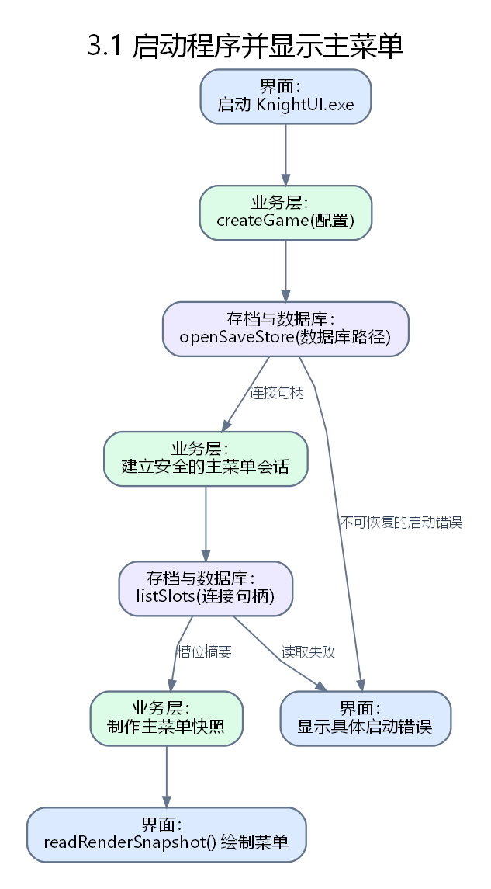

**触发：** 用户打开未来的 `KnightUI.exe`。

1. 界面创建窗口，调用业务层 `createGame`；业务层初始化自身会话状态。
2. 业务层让存档模块打开数据库、检查模式版本并读取存档槽位摘要；界面不直接打开数据库。
3. 业务层生成主菜单画面快照，告诉界面哪些菜单项可用。若数据库打不开，`createGame` 返回错误，界面显示原因并等待用户修复路径或重试启动。
4. 此时不创建关卡中的玩家世界，也不运行战斗逻辑。

### 3.2 鼠标点击“开始游戏”

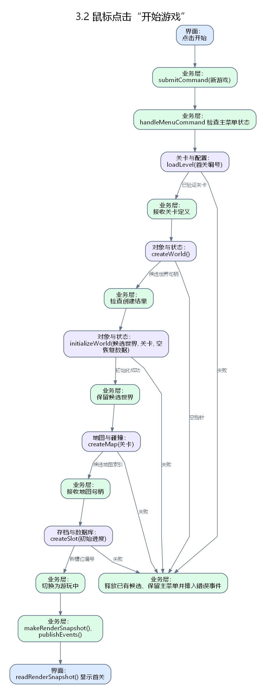

**触发：** 界面收到按钮点击，映射成一次“新游戏”命令，调用 `submitCommand`。

1. 协调器确认当前为主菜单，锁定一次性命令，避免双击创建两个槽位。
2. 调用关卡与配置模块 `loadLevel`，完整读取、校验首关和对象原型；失败则留在主菜单并给出错误事件。
3. 调用对象与状态模块建立候选世界并执行 `initializeWorld`；失败时销毁候选世界，原会话保持安全。
4. 调用地图模块 `createMap` 建立候选空间索引；失败时释放候选世界，原会话保持安全。
5. 调用存档模块 `createSlot` 建立槽位；失败时释放候选世界和地图索引，提示新建失败。
6. 全部成功后，协调器将候选世界及地图索引设为当前会话，状态变为“游玩中”，生成玩家出生与关卡进入事件。
7. 界面读取新画面快照，显示地图、玩家和状态栏。

状态和地图句柄的创建、销毁由协调器安排；状态模块与地图模块不互相调用。开始流程需要作为一个整体处理失败，不能进入“有玩家但关卡地图未就绪”的状态。

### 3.3 点击“继续游戏”并选择存档

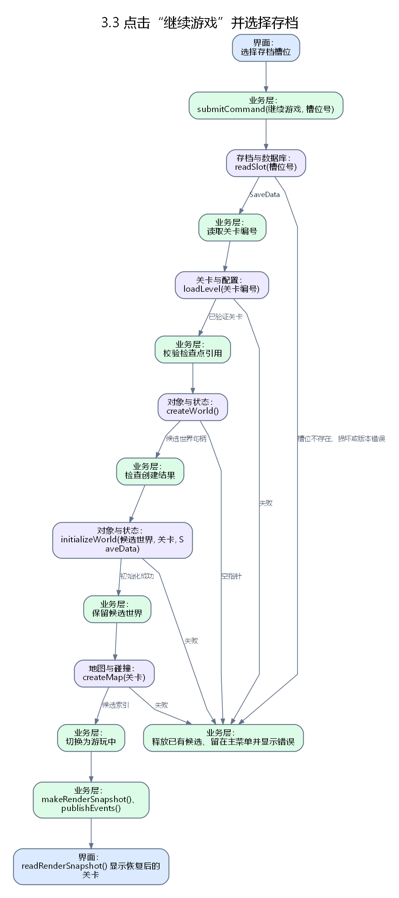

**触发：** 主菜单选择槽位。

1. 协调器检查槽位选择，调用存档模块 `readSlot`；格式版本不兼容或损坏时留在主菜单。
2. 根据存档中的关卡编号调用关卡与配置模块 `loadLevel`，检查存档引用的关卡、检查点和永久物品仍存在。
3. 用已验证的关卡定义和 `SaveData` 调用状态模块 `initializeWorld`，按最近检查点恢复玩家和永久进度。
4. 创建本关地图索引；全部成功后切换当前会话，发布关卡进入事件。任一步失败均不覆盖原安全会话。

### 3.4 按下、按住和松开左右移动键

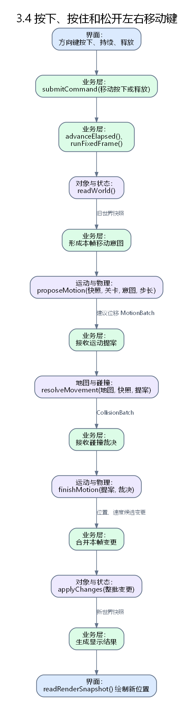

**触发：** 界面把物理键映射为“左移/右移”按下或释放。

1. `submitCommand` 记录方向键状态；重复按下事件不重复改变状态。若左右同时按住，按约定抵消为零方向。
2. 每个逻辑帧，协调器从状态模块 `readWorld` 取得玩家位置、速度与落地信息，形成方向意图。
3. 运动模块 `proposeMotion` 产生建议速度和位移；地图模块 `resolveMovement` 裁决阻挡。
4. 运动模块 `finishMotion` 根据碰撞结果形成位置、速度和落地候选变更。
5. 协调器在第 7 步调用状态模块 `applyChanges`。界面从新快照绘制位置与朝向。
6. 松开按键后，业务层更新按住状态；下一帧不再生成该方向的持续意图。

### 3.5 按下跳跃键

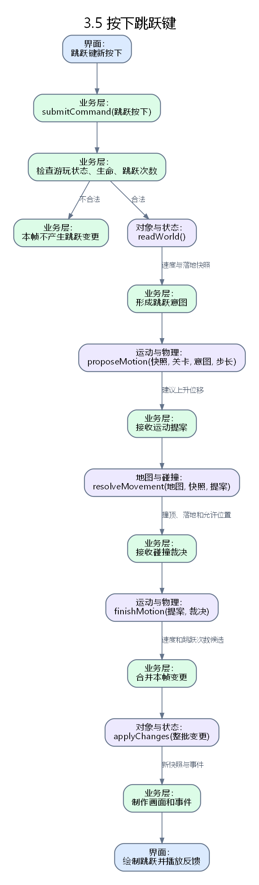

**触发：** 一次新的“跳跃”按下边沿。

1. 协调器检查会话处于游玩中、玩家存活、未被禁用动作、剩余跳跃次数和当前落地或空中跳跃规则。
2. 合法时把跳跃意图送给运动模块；运动模块给出初始纵向速度和建议位移。
3. 地图模块裁决撞顶与落地；运动模块根据结果输出最终速度和跳跃次数候选变更。
4. 第 7 步提交后，界面根据事件和快照播放跳跃动画。非法跳跃请求不改变世界。

### 3.6 按住移动键时按 J 攻击，以及再次攻击

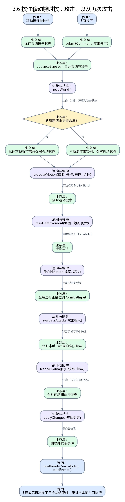

**触发：** 界面将 J 的一次新按下映射为“攻击”；J 的按键释放重新允许下一次新按下边沿。

1. 业务层分别保存“移动正在按住”和“攻击本帧新按下”；两者可以在同一帧并存。
2. 协调器检查玩家存活、攻击冷却、能量和动作限制。未通过时不产生攻击实例，并可生成反馈事件。
3. 同帧先调用 `proposeMotion`、`resolveMovement`、`finishMotion`，使攻击使用修正后的玩家位置；然后把攻击请求、攻击原型、修正后位置及现有攻击实例交给战斗模块 `evaluateAttacks`。
4. 战斗模块推进起手、有效、收招阶段；有效阶段按命中框、阵营和本次攻击已命中集合计算候选伤害。
5. `resolveDamage` 检查目标无敌截止帧，输出扣血、击退、无敌时间和死亡候选；协调器与运动变更合并后一次交给状态模块。
6. 界面通过一次性事件播放挥击、命中和受击效果。移动键继续按住时，下一帧仍可移动；J 松开再按且冷却完成后，必须能发起下一次攻击。

本流程的验收条件是：**持续按住移动键，不妨碍 J 的第二次及以后合法攻击**；同一次挥击对同一目标只扣一次血。

### 3.7 敌人巡逻、发现玩家并攻击

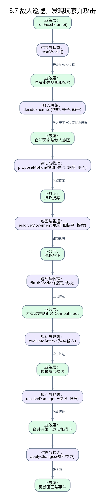

1. 协调器从状态模块取得只读快照，向敌人决策模块 `decideEnemies` 提供敌人、玩家位置和关卡决策配置。
2. 决策模块返回巡逻、警戒、追击、攻击或返回的意图，以及决策状态候选变更；不直接改敌人坐标。
3. 运动模块计算敌人建议位移，地图模块裁决；攻击意图由协调器在本帧交给战斗模块。
4. 第 7 步统一提交敌人位置、决策状态及战斗结果。玩家离开脱离半径后，敌人按配置返回巡逻。

### 3.8 碰到陷阱、受伤和死亡

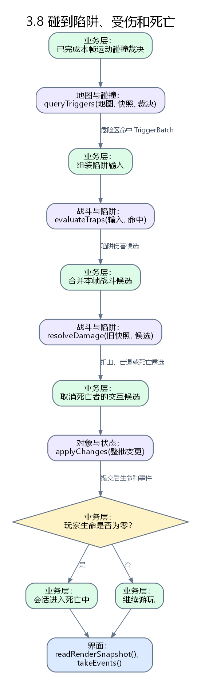

1. 地图模块 `queryTriggers` 返回玩家与危险区的重叠；协调器把触发结果、陷阱配置及玩家状态交给战斗模块 `evaluateTraps`。
2. 战斗模块按陷阱相位、启用状态、每目标再次伤害间隔和无敌截止帧生成伤害候选；静态尖刺持续有效，周期机关按逻辑帧计算相位。
3. 战斗模块 `resolveDamage` 决定生命和击退候选。协调器第 7 步提交后，若生命为零，第 8 步把会话状态转为“死亡中”。
4. 死亡所在帧的拾取、检查点和出口候选被取消；界面只根据事件和新快照播放死亡反馈。

### 3.9 拾取物品、激活检查点

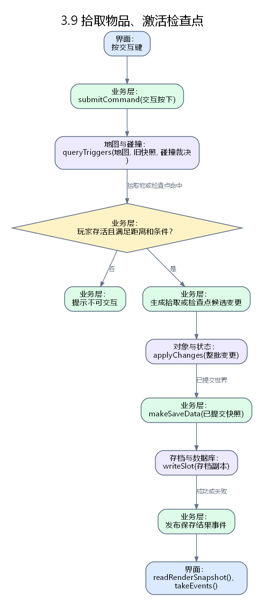

1. 玩家按交互键时，业务层在地图模块的触发列表中查找可交互对象，并检查距离、存活状态及对象条件。
2. 拾取物形成背包或能量候选变更；检查点形成当前检查点候选变更。业务层将它们与本帧其他变更合并，第 7 步提交。
3. 需要持久化的关键物品或检查点从**提交后的快照**生成 `SaveData`，调用存档模块 `writeSlot`。
4. 保存成功和失败都生成明确事件；失败时已发生的内存进度仍保留，并标明“尚未保存”，允许重试。

### 3.10 到达出口、完成目标并进入下一关

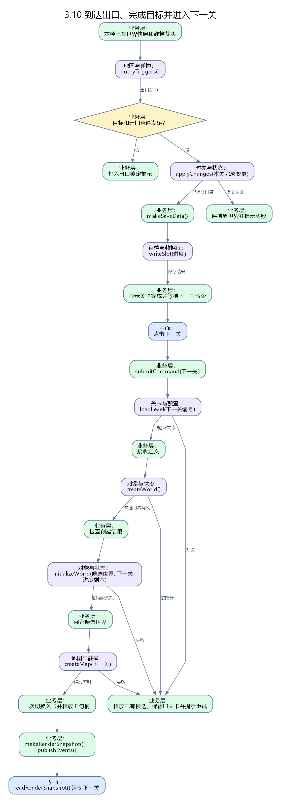

1. 地图模块报告出口区域命中；业务层检查玩家存活、必要物品、指定敌人是否清除及出口开启条件。
2. 条件未满足时只生成“出口未开启”提示；不切关、不删世界。
3. 条件满足时先提交本关完成状态，再更新内存进度并请求存档。保存失败需明确提示，但不抹掉内存中已完成的事实。
4. 选择进入下一关后，关卡与配置模块先完整加载并校验新关；状态模块建立候选新世界，地图模块建立候选索引。
5. 两个候选都成功后，协调器一次切换当前关卡并释放旧句柄。失败时保留已完成的旧关卡状态，界面可提示重试。

### 3.11 暂停、继续与窗口失焦

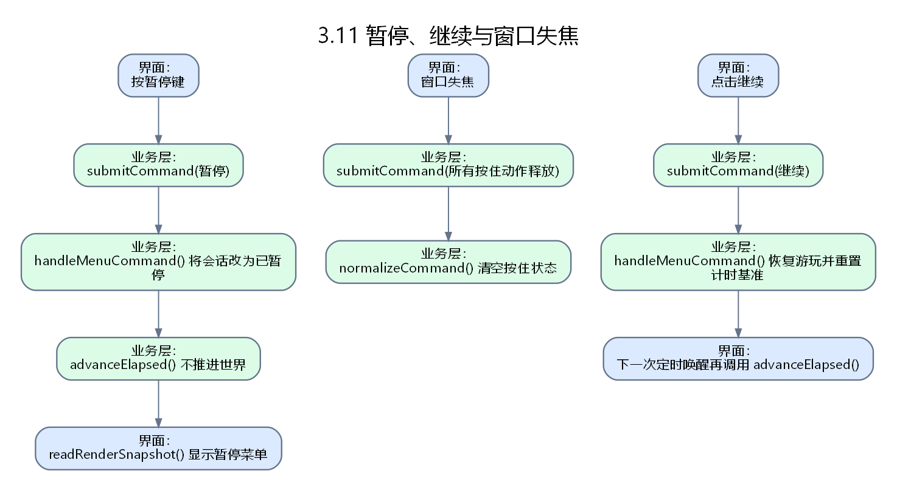

1. 游玩中按暂停键时，业务层先于玩法帧处理暂停命令，状态变成“已暂停”，停止逻辑时间累积和战斗推进。
2. 暂停菜单点击“继续”后，业务层清空旧按住状态并重置计时基准，返回游玩中；避免窗口停顿造成一次推进大量逻辑帧。
3. 窗口失焦时界面报告释放所有正在按住的动作。重新获得焦点不自动恢复按住，需要玩家重新按键。

### 3.12 死亡后复活或菜单中选择重试

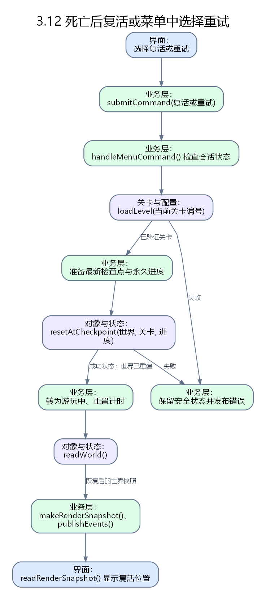

1. 死亡界面收到“复活”，或暂停菜单收到“重试”；业务层检查对应会话状态。
2. 关卡与配置模块提供本关定义，存档或当前已提交世界提供最近检查点标识；业务层验证复活位置安全。
3. 状态模块 `resetAtCheckpoint` 重建玩家、敌人和陷阱运行状态，按复活规则恢复生命；永久能力和关键物品按进度保留。
4. 地图索引仍对应同一关卡时可继续使用。成功后会话进入游玩中；失败时保持可显示错误的安全状态。

### 3.13 保存并返回菜单、退出程序

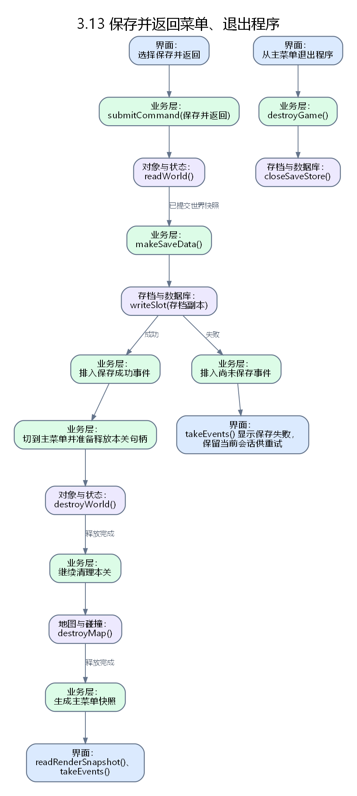

1. “保存并返回菜单”先使业务层停止玩法推进，从最新已提交世界提取 `SaveData`，请求 `writeSlot`。
2. 保存成功后才切到主菜单并释放本关句柄。保存失败则保留当前会话，提示“尚未保存”并允许重试；不能一边显示保存成功，一边丢失尚未落盘的进度。
3. 从主菜单退出程序时，界面调用 `destroyGame`；业务层释放自己持有的世界、地图、数据库等句柄，存档模块负责关闭自己的连接。

## 4 两人联调时的逐项验收

| 验收场景 | 应观察到的结果 | 主要涉及接口 |
|---|---|---|
| 连续按住右移并多次短按 J | 移动持续；每次冷却完成后的新按下都能攻击 | `submitCommand`、`proposeMotion`、`evaluateAttacks`、`applyChanges` |
| 玩家撞墙后继续按右移 | 位置不穿墙，速度和落地状态正确 | `resolveMovement`、`finishMotion`、`applyChanges` |
| 玩家接触持续尖刺 | 按无敌时间和伤害间隔扣血，不按绘图动画扣血 | `queryTriggers`、`evaluateTraps`、`resolveDamage` |
| 激活检查点后强制模拟保存失败 | 内存检查点可见，界面提示尚未保存，旧存档仍可读取 | `applyChanges`、`writeSlot` |
| 下一关文件缺失 | 当前已完成关卡保留，可重试加载 | `loadLevel`、`initializeWorld` |
| 窗口失焦时仍按住移动键 | 焦点恢复后角色不会自行继续移动 | `submitCommand`、`advanceElapsed` |
| 底层模块单独编译 | 任一底层模块都不链接其他底层模块 | 各模块的 CMake 目标和公开头文件 |

每个场景都应按“命令编号 → 逻辑帧 → 模块候选结果 → 唯一状态提交 → 事件和画面快照”记录问题。两人分头实现时，只要输入、输出和顺序保持一致，就能在业务层完成联调。

